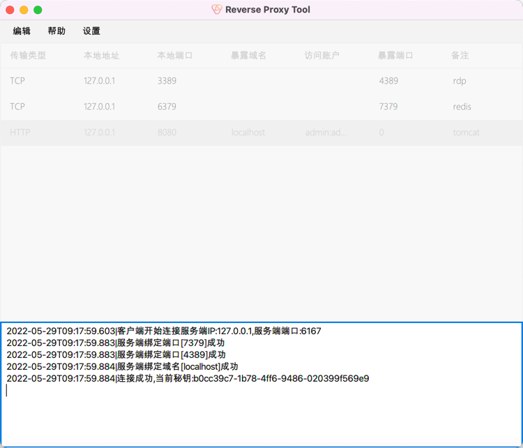

 

### 内网穿透工具

> 一个可用于内网穿透的工具，将局域网个人电脑、服务器映射到公网。

> 支持任何TCP上层协议，可用于远程桌面、访问内网网站、SSH访问、远程连接打印机、本地支付接口调试、微信小程序调试...

> 支持HTTP端口复用，可用于内网反向代理，共用服务端80/443端口。支持HTTP请求升级为WebSocket，HTTP2。

> SSL双端验证，数据加密传输。

> 部署简单，提供桌面客户端。

---

## GUI客户端

- 主界面


- 系统配置


- TCP映射配置


- HTTP映射配置


- 删除映射配置


- 控制台输出



---

## 快速体验 Quick Start

- 启动服务端

`java -jar rpt-server-*.jar -c server.yml`

- 启动客户端

`java -jar rpt-client-*.jar -c client.yml`

## 服务端配置`server.yml`

```yaml
#服务端绑定IP
serverIp: 0.0.0.0
#服务端与客户端通讯端口
serverPort: 6167
#服务端暴露的HTTP重定向端口 为0则不开启 默认值0
httpPort: 80
#服务端暴露的HTTPS复用端口 为0则不开启 默认值0
httpsPort: 0
# 域名证书公钥(需替换) httpsPort为0时不生效 默认值server.crt
domainCert: server.crt
# 域名证书私钥(需替换) httpsPort为0时不生效 默认值pkcs8_server.key
domainKey: pkcs8_server.key
# 是否限制连接暴露端口的IP必须在当前地区国家 默认值false
ipFilter: true
#授权给客户端的秘钥
token:
  - clientKey: b0cc39c7-1b78-4ff6-9486-020399f569e9
    # 限制绑定端口范围 左右闭区间  默认值[1,65535]
    minPort: 4000
    maxPort: 8000
  - clientKey: 4befea7e-a61c-4979-b012-47659bab6f21
    minPort: 9000
    maxPort: 9999
```

## 客户端配置`client.yml`

```yaml
#服务端IP
serverIp: 127.0.0.1
#服务端与客户端通讯端口
serverPort: 6167
#授权给客户端的秘钥
clientKey: b0cc39c7-1b78-4ff6-9486-020399f569e9

# remotePort与localPort映射配置
config:
  - # 传输协议类型 (TCP或者HTTP) 不填写默认就是TCP
    proxyType: TCP
    # 客户端连接目标IP
    localIp: 127.0.0.1
    # 客户端连接目标端口
    localPort: 3389
    # 服务暴露端口
    remotePort: 4389
    # 描述
    description: rdp

  - proxyType: TCP
    localIp: 127.0.0.1
    localPort: 6379
    remotePort: 7379
    description: redis

  - proxyType: HTTP
    localIp: 127.0.0.1
    localPort: 8080
    # 访问域名(*.domain.com 用二级域名指向 eg:test.domain.com)
    domain: test.domain.com
    # 访问资源时登录的账号和密码(账号:密码) 非必填
    token: admin:admin
    description: tomcat
```

## 进阶部署

首先在jar包的当前目录,新建conf文件夹,并将相应的配置文件(`client.yml`或者`server.yml`)放进去

启动脚本`start.sh`

```shell
java -server -d64 -XX:+UseG1GC -XX:MaxGCPauseMillis=200 -Dnetworkaddress.cache.ttl=600 \
     -Djava.security.egd=file:/dev/./urandom -Djava.awt.headless=true -Duser.timezone=Asia/Shanghai -Duser.country=CN \
     -Dclient.encoding.override=UTF-8 -Dfile.encoding=UTF-8 -Xbootclasspath/a:./conf \
     -jar rpt*.jar  > /dev/null 2>&1 & echo $! > pid.file &
```

关闭脚本`stop.sh`

```shell
kill $(cat pid.file)
```

## Docker 镜像地址

https://hub.docker.com/r/promptness/rpt-client

## 更新IP库

https://dev.maxmind.com/geoip/geolite2-free-geolocation-data

https://github.com/Loyalsoldier/geoip/releases

https://github.com/Dreamacro/maxmind-geoip/releases

将下载的Country.mmdb放入server端的conf文件夹中

## SSL证书申请

详细操作步骤看这里
[OpenSSL申请证书](doc/OpenSSL.md)

## 替换证书

如果需要替换证书则:

client端需要在conf文件夹里面放置`client.crt`和`pkcs8_client.key`和`ca.crt`

server端需要在conf文件夹里面放置`server.crt`和`pkcs8_server.key`和`ca.crt`

## 注册Windows服务

将rpt-client.jar注册Windows服务可开机自启动

下载 [winsw工具](https://github.com/winsw/winsw/releases) ,将WinSW-x64.exe文件重命名为rpt-client.exe, 和rpt-client.jar放在同一个目录中,
在该目录中新建文件rpt-client.xml文件,写入如下内容

```xml

<service>
    <id>rpt-client</id>
    <name>rpt-client</name>
    <description>rpt-client</description>
    <executable>java</executable>
    <arguments>-server -d64 -XX:+UseG1GC -XX:MaxGCPauseMillis=200 -Dnetworkaddress.cache.ttl=600 -Djava.security.egd=file:/dev/./urandom -Djava.awt.headless=true -Duser.timezone=Asia/Shanghai -Duser.country=CN -Dclient.encoding.override=UTF-8 -Dfile.encoding=UTF-8 -Xbootclasspath/a:./conf -jar rpt-client.jar
    </arguments>
</service>
```

执行`rpt-client.exe install`即可完成注册为Windows服务

## 其他

[补充说明](doc/OTHER.md)
